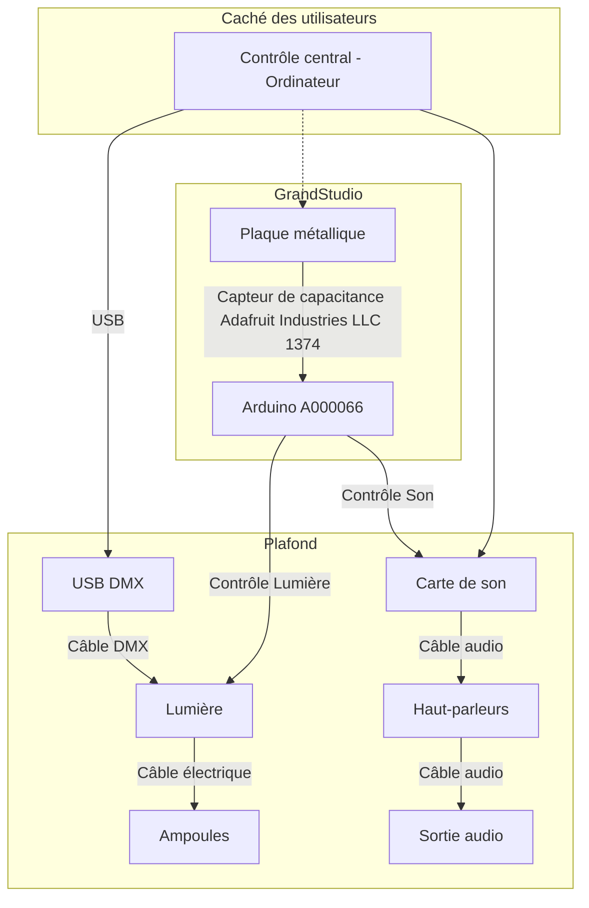

# Planification Luminatura
---

***Luminatura***, où la lumière et la nature s'entrelacent pour éclairer l'esprit à travers la magie des lanternes.

## Concept
---

***Luminatura*** est une installation immersive alliant art et technologie, où des lanternes illuminent votre parcours et des vignes décorent l'espace, créant ainsi une atmosphère accueillante. En touchant une plaque métallique, le capteur capacitif détecte la conductivité des mains de l'utilisateur et déclenche une réponse lumineuse et sonore, illustrant le potentiel de transformation que chacun peut exercer sur son environnement.

### Mise en contexte

À l'entrée de l'installation, le visiteur est accueilli par la douce lumière des lanternes suspendues et les vignes décoratives qui créent une ambiance de tranquillité.

En touchant la plaque, le visiteur déclenche une lumière douce et chaleureuse, accompagnée de sons apaisants de la nature. Ce moment intime lui permet de réfléchir à ses propres expériences de transformation et d’éveiller des émotions profondes, soulignant le pouvoir de l'art et de la technologie pour toucher l'âme humaine.

## Synoptique
---

## Scénarimage
---

## Plantation
---

## Simulation
---

## Devis Technique
---
### Équipements et matériaux
---
### Équipements fournis par l’artiste

- 15 vignes artificielles en plastique 
- 10 ampoules LED 
- 1 plaque acier inoxydable 
- 10 lanternes en polycarbonate
- Régulateur de tension
- Câbles en acier inoxydable
- Boucles avec embouts pour câble inoxydable
- Éléments de fixation
- Plaque ronde d'acier (épaisseur 1mm)
- Plaques isolantes 
  
#### Capteurs et évaluation

| Capteur de type « sensing capacitif »                    | Composants                   |
| -------------------------------------------------------- | ---------------------------- |
| Carte d'évaluation pour microcontrôleurs embarqués (MCU) | Arduino A000066              |
| Résistances traversantes                                 | YAGEO CFR-25JB-52-3M6        |
| Carte d'évaluation de capteurs                           | Adafruit Industries LLC 1374 |

#### Support en métal

| Support en métal pour la plaque métallique | Composants                        |
| ------------------------------------------ | --------------------------------- |
| 1 tube en acier                            | Structure principale du « stand » |
| 1 base plate                               | Assurer la stabilité du « stand » |
| Vis et boulons                             | Assemblage et durabilité          |

### Équipements fournis par le cégep

- Câbles (HDMI, Ethernet, audio)
- Fils de prototypage
- 1 ordinateur (gestion des interactions en temps réel)
- 2 haut-parleurs GENELEC 8040B

### Logiciels 

---
### Logiciels fournis par l’artiste
  
| Logiciel | Technique                                                         |
| -------- | ----------------------------------------------------------------- |
| Reaper   | Montage sonore (de base)                                          |
| Arduino  | Capteur de type « sensing capacitif » et connexion des composants |

### Logiciels fournis par le cégep

| Logiciel  | Technique                                                     |
| --------- | ------------------------------------------------------------- |
| Pure Data | Modification des paramètres audio en réponse à des événements |
| QLC+      | Création des scènes lumineuses                                |
| Plugdata  | Modification de la couleur des lumières                       |

### Mise en réseau et communication

---
### Fourni par le cégep

| Système de communication | Logiciel | Interaction         |
| ------------------------ | -------- | ------------------- |
| Protocole MIDI           | LoopMidi | QLC+ et Plugdata    |
| Protocole DMX            | QLC+     | Lumière et logiciel |

### Répartition des responsabilités
---
#### Préparation des espaces

* Électricité
* Connexion réseau
* Espace pour le montage des dispositifs (extérieur du cyclorama)
