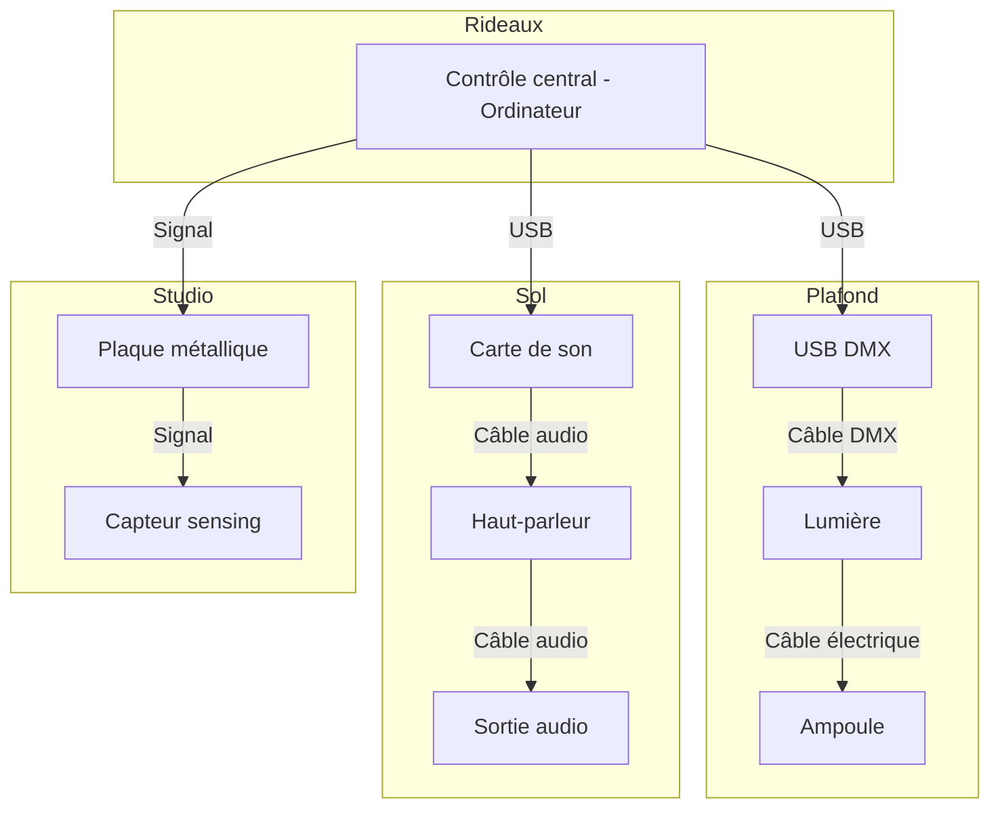

# Planification Luminatura

## Synoptique

## Scénarimage
---
 
 
 
 

## Devis Technique
---
### Équipements et matériaux
---
### Équipement fourni par l’artiste

- 15 Vignes Artificielles
- 10 Ampoules LED 
- 1 Plaque métallique 
- 10 Lanternes en polycarbonate
- Régulateur de tension
- Fil de cuivre ou d'acier

#### Capteurs et Évaluation

| Capteur de type «sensing capacitif»                       | Composants                   |
| --------------------------------------------------------- | ---------------------------- |
| Cartes d'évaluation pour microcontrôleurs embarqués (MCU) | Arduino A000066              |
| Résistances traversantes                                  | YAGEO CFR-25JB-52-3M6        |
| Cartes d'évaluation de capteurs                           | Adafruit Industries LLC 1374 |

#### Support en Métal

| Support en métal pour la plaque métallique | Composants                          |
| ------------------------------------------ | ----------------------------------- |
| 1 Tube en acier ou en aluminium            | Structure principale du « stand »   |
| 1 Base plate                               | Assurer la stabilité du « stand »   |
| Vis et boulons                             | Assembler et garantir la durabilité |

### Équipement fourni par le cégep

- Câbles (HDMI, Ethernet, audio)
- Éléments de fixation
- Fils de prototypage
- 1 Ordinateur (gestion des interactions en temps réel)
- 2 Haut-parleurs

### Logiciels
---
### Logiciels fournis par l’artiste
  
| Logiciel | Technique                                                                |
| -------- | ------------------------------------------------------------------------ |
| Reaper   | Montage sonore (base)                                                    |
| Arduino  | Capteur de type «sensing capacitif» et connecter les composants ensemble |

### Logiciels fournis par le cégep

| Logiciel  | Technique                                                 |
| --------- | --------------------------------------------------------- |
| Pure Data | Modifier des paramètres audio en réponse à des événements |
| QLC+      | Création des scènes lumineuses                            |
| Plugdata  | Modifier la couleur des lumières                          |

### Mise en réseau et de communication
---
### Fournis par le cégep

| Système de communication | Logiciel | Interaction         |
| ------------------------ | -------- | ------------------- |
| Protocole MIDI           | LoopMidi | QLC+ et Plugdata    |
| Protocole DMX            | QLC+     | Lumiere et logiciel |

### Allocation des responsabilités
#### Préparation des espaces

* Électricité
* Connexion réseau
* Espace pour le montage des dispositifs (extérieur du cyclorama)
